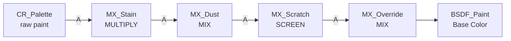

# ISO Container Metal — Shader Specification

> [!info] Version
> **v5** — Blender 5.0+ · Procedural · No texture maps required
> Script: `iso_container_metal_v5.py` · Run from the Scripting workspace.

## Overview

A fully procedural Blender shader for ISO shipping containers. All variation — colour, rust distribution, water stains, dust, scratches, roughness — is driven by a single per-object custom property (`container_seed`), making it suitable for large-scale instancing where each container must look unique without any manual texture work.

The shader is packaged as a **node group** (`ISO_Container_Shader`) inside a material (`ISO_Container_Metal`). A control panel on the group node exposes six live parameters without requiring the node tree to be opened.

---

## Quick-Start

### 1. Run the script

Open `iso_container_metal_v5.py` in the **Scripting** workspace and press **Run Script**. The material and node group are created (or recreated cleanly if they already exist).

### 2. Assign the material

Select your container mesh and assign `ISO_Container_Metal` in the **Material Properties** panel.

### 3. Set the seed per object

On each container object, add a custom property:

> **Properties → Object Properties → Custom Properties**
> Name: `container_seed` · Type: Float · Range: `0.0 – 1.0`

Different seed values produce different colours and unique weathering patterns. See [[#Seed System]] for details.

### 4. Tune via the control panel

Select the group node in the Shader Editor, open the **N panel → Item tab**. The six inputs are live sliders. See [[#Control Panel]] for the full reference.

> [!tip] Geometry Nodes instancing
> When scattering containers via Geometry Nodes, drive `container_seed` with a **Store Named Attribute** node fed by a **Random Value** (Float) node. This populates the attribute automatically per instance with no manual setup.

---

## Configuration Constants

These values live at the top of the script and are the only section you should need to edit between projects.

| Constant | Default | Description |
|---|---|---|
| `MAT_NAME` | `ISO_Container_Metal` | Blender material data-block name |
| `GROUP_NAME` | `ISO_Container_Shader` | Node group data-block name |
| `Z_BOTTOM` | `-2.0` | Object-space Z at the base of the container |
| `Z_TOP` | `2.0` | Object-space Z at the top of the container |
| `Z_MID` | `0.0` *(derived)* | Midpoint; computed as `(Z_BOTTOM + Z_TOP) / 2` |

> [!warning] Z range must match your mesh
> `Z_BOTTOM` and `Z_TOP` control where the dust band ends and where water stains begin. If your container uses a different scale or a bottom-anchored origin, update these two values before running the script or the height-based effects will appear at the wrong positions.

---

## Material Settings

| Property | Value |
|---|---|
| `blend_method` | `HASHED` |
| `displacement_method` | `BUMP` |
| `surface_render_method` | `DITHERED` |

---

## Control Panel

Accessible on the group node via **N panel → Item tab**, or by right-clicking any socket and choosing *Copy to Input* to expose it in the material properties sidebar.

| # | Input | Type | Range | Default | Effect |
|---|---|---|---|---|---|
| 0 | **Rust Strength** | Float | 0 – 2 | 0.35 | Overall rust coverage. Values above 1 produce heavily corroded containers. |
| 1 | **Water Stain Intensity** | Float | 0 – 1 | 0.60 | Density and darkness of mineral streaks on the upper walls. |
| 2 | **Dust Intensity** | Float | 0 – 1 | 0.65 | Combined strength of the ground-level dirt band and AO-driven crevice grime. |
| 3 | **Scratch Intensity** | Float | 0 – 1 | 0.25 | Density of bare-metal horizontal scratch marks. |
| 4 | **Base Color Override** | Color | — | Container red `(0.55, 0.07, 0.04)` | Manual colour used when *Color Override Amount* > 0. |
| 5 | **Color Override Amount** | Float | 0 – 1 | 0.0 | `0` = fully random palette via `container_seed`. `1` = fully manual colour. Partial values blend between them. |

---

## Seed System

A single `ShaderNodeAttribute` node reads the object custom property `container_seed` (0–1 float). Its **Fac** output drives two separate systems simultaneously.

### Palette selection

The `Fac` value indexes into `CR_Palette`, a CONSTANT-interpolation colour ramp with 8 bands. Each band covers a `0.125` wide range, so 8 distinct colours map to the seed ranges below.

| Band | Seed range | Linear RGB | Appearance |
|---|---|---|---|
| 0 | 0.000 – 0.124 | `(0.021, 0.095, 0.270)` | Navy |
| 1 | 0.125 – 0.249 | `(0.007, 0.022, 0.056)` | Near-black blue |
| 2 | 0.250 – 0.374 | `(0.027, 0.133, 0.381)` | Mid blue |
| 3 | 0.375 – 0.499 | `(0.292, 0.047, 0.026)` | Bright red |
| 4 | 0.500 – 0.624 | `(0.184, 0.032, 0.019)` | Mid red |
| 5 | 0.625 – 0.749 | `(0.120, 0.022, 0.014)` | Dark red |
| 6 | 0.750 – 0.874 | `(0.009, 0.061, 0.006)` | Dark green |
| 7 | 0.875 – 1.000 | `(0.216, 0.216, 0.216)` | Steel gray `#7F7F7F` |

### Per-noise W offset

Every noise texture is 4D. The seed value is multiplied by a unique **prime scale** and added to a **base W offset** to produce each noise's W input:

```
W  =  W_BASE  +  (container_seed  ×  W_SCALE)
```

Two helper math nodes are built automatically per noise (`W_Mul_<name>` and `W_Add_<name>`).

| Noise node | Effect | `W_BASE` | `W_SCALE` (prime) |
|---|---|---|---|
| `N_Roughness` | Surface roughness variation | 3.0 | 7.31 |
| `N_Specular` | Specular IOR variation | 1.0 | 13.73 |
| `N_RustPat` | Rust spread pattern | 0.0 | 5.03 |
| `N_RustBump` | Oxide surface relief | 0.0 | 17.39 |
| `N_Stain` | Water streak positions | 0.0 | 11.93 |
| `N_Dust` | Dust edge breakup | 0.0 | 3.71 |
| `N_Scratch` | Scratch line positions | 0.0 | 19.13 |

> [!note] Why prime scales?
> Prime values have no common factors, so for any seed value the W planes of all seven noises are mutually incommensurable. Using simple integers (×1, ×2, ×4…) would create harmonic coincidences at certain seed values where multiple effects sync up and look correlated.

---

## Node Architecture

### Coordinate system

| Node | Source | Used by |
|---|---|---|
| `TexCoord` (Object output) | Mesh object space | All noise textures, height tests |
| `Mapping` | `TexCoord.Object` | Shared vector `vmp` for most noises |
| `MP_Stain` | `TexCoord.Object` · scale `(8, 8, 0.25)` | Water stain noise only |
| `MP_Scratch` | `TexCoord.Object` · scale `(1, 1, 0.04)` | Scratch noise only |
| `SepXYZ` | `TexCoord.Object` | Extracts Z for all height gradients |

The weathering-specific mappings use Z-axis compression to reshape noise into elongated forms: `0.25×` for stains (vertical streaks), `0.04×` for scratches (near-horizontal lines).

### Composite pipeline

The colour layers are applied as a chain. Each node's **A input** receives the previous node's output.



| Layer | Node | Blend mode | B colour (linear) | Physical rationale |
|---|---|---|---|---|
| Water stains | `MX_Stain` | MULTIPLY | `(0.070, 0.045, 0.020)` dark mineral brown | Darkens without erasing; mineral deposits tint rather than replace the paint |
| Dust / grime | `MX_Dust` | MIX | `(0.380, 0.300, 0.170)` warm grit | Fully replaces paint with an earth-coloured layer at maximum intensity |
| Scratches | `MX_Scratch` | SCREEN | `(0.550, 0.500, 0.420)` bare steel gleam | Adds brightness along scratch lines without erasing the underlying colour |
| Colour override | `MX_Override` | MIX | *user-chosen via panel* | Fades between the weathered paint result and a manually chosen colour |

---

## Weathering Layers — Detail

### Roughness & Specular

Two independent 4D FBM noise textures vary surface roughness and specular response across the surface, simulating uneven paint weathering and metal oxidation. Both use EASE-interpolation colour ramps to remap the noise output into the useful shading range.

| Parameter | `N_Roughness` | `N_Specular` |
|---|---|---|
| Type | 4D FBM | 4D FBM |
| Scale | 3.5 | 5.0 |
| Detail | 15.0 | 10.0 |
| Roughness | 0.76 | 0.76 |
| Lacunarity | 2.0 | 2.0 |
| Output ramp range | grey `0.36` → white `1.0` | grey `0.36` → white `1.0` |
| Drives | `BSDF_Paint.Roughness` | `BSDF_Paint.Specular IOR Level` |

### Rust system

Rust coverage is the product of two masks, scaled by **Rust Strength**, used as the factor of a `MixShader` node blending clean paint and corroded metal.

**Edge mask** — The dot product of the face normal and the bevel normal (`ShaderNodeBevel`, radius `0.05 m`, 4 samples) is close to 1 on flat surfaces and drops below 1 at edges. A CARDINAL-interpolation ramp maps this so only edges are white (rust-eligible). Rust forming preferentially at edges and corners matches physical reality.

**Surface pattern** — A MULTIFRACTAL 4D noise (scale 1.0, detail 14, roughness 1.0, lacunarity 1.55, normalise off) produces an irregular organic spread. Thresholded at position `0.848` by a LINEAR ramp.

**Combination**: `MULTIPLY(edge_mask, surface_pattern) × Rust_Strength → MixShader.Factor`

**Rust bump** — A separate high-frequency 4D FBM noise (scale 350, detail 2, roughness 0.5) drives a `ShaderNodeBump` node (strength `0.208`, distance `1.0`, filter width `0.1`), feeding `BSDF_Rust.Normal` to add oxide-texture surface relief.

**BSDF comparison**:

| Parameter | `BSDF_Paint` | `BSDF_Rust` |
|---|---|---|
| Distribution | MULTI_GGX | MULTI_GGX |
| Metallic | 0.65 | 0.75 |
| Roughness | *from `N_Roughness`* | 0.95 (matte oxide) |
| IOR | 1.45 | 1.50 |
| Specular IOR Level | *from `N_Specular`* | 0.08 (very low gloss) |
| Base Color | Weathered paint composite | Rust bump colour tint |
| Normal | Default | Rust bump normal |

### Water stains

Mineral streaks flowing downward from the top border, constrained to the upper half of the container.

**Streak technique** — `MP_Stain` compresses Z to `0.25×` before sampling `N_Stain`. Because the noise is evaluated in a space where Z is much smaller, the blobs stretch vertically in object space into streak shapes.

**Height gate** — `MR_StainH` maps `Z_MID → 0.0` and `Z_TOP → 1.0` (clamped). Fragments at or below the midpoint return 0, so no stains appear on the lower walls. An EASE ramp on the height output smooths the transition to avoid a visible horizontal cutoff line.

| Parameter | Value |
|---|---|
| Mapping Z scale | 0.25 |
| Noise type | 4D FBM |
| Noise scale | 14.0 |
| Detail | 3.0 |
| Roughness | 0.65 |
| Pattern ramp | LINEAR: black at 0.55, white at 0.80 |
| Height range | `Z_MID` (0) → `Z_TOP` (1) |
| Height ramp | EASE: black → white |
| Blend mode | MULTIPLY |
| Stain colour | `(0.070, 0.045, 0.020)` dark mineral brown |

### Dust / grime

Ground-level dirt on the lower body plus AO-driven crevice grime throughout, combined with `MAXIMUM`.

**A — Height band**

| Node | Setting |
|---|---|
| `MR_DustH` | `Z_BOTTOM → 1.0`, `Z_BOTTOM + 2.5 → 0.0` (clamped) |
| `N_Dust` | Scale 5.0, detail 4.0, roughness 0.7 |
| Combination | `height_gradient × N_Dust` — noise breaks up the horizontal edge |
| `CR_DustH` | EASE: black at 0.00, 50% grey at 0.15, white at 1.00 |

**B — Ambient occlusion**

| Node | Setting |
|---|---|
| `AO` node | Samples 16, distance `1.0 m`, global (not local-only) |
| Inversion | `1.0 − AO` — high value where surfaces are occluded |
| `CR_AO` | EASE: black 0.00–0.35, transition 0.35–0.65, white 0.65–1.00 |

`MAXIMUM(A, B)` — whichever source is stronger wins; the two masks do not amplify each other.

> [!note] AO distance tuning
> Increase the AO node **Distance** value (default `1.0 m`) to widen the grime radius around crevices. Lower values restrict grime to tight corners and panel joints only.

### Scratches

Horizontal handling marks simulating forklift tines, stacking damage, and general abrasion.

**Technique** — `MP_Scratch` compresses Z to `0.04×`, making the noise almost entirely horizontal in object space. A CONSTANT-interpolation ramp thresholds at position `0.92`, producing sharp crisp lines with no gradual fade. SCREEN blend adds brightness without erasing the underlying colour.

| Parameter | Value |
|---|---|
| Mapping Z scale | 0.04 |
| Noise type | 4D FBM |
| Noise scale | 40.0 |
| Detail | 2.0 |
| Roughness | 0.8 |
| Lacunarity | 2.5 |
| Pattern ramp | CONSTANT: white at 0.92 |
| Blend mode | SCREEN |
| Scratch colour | `(0.55, 0.50, 0.42)` bare steel gleam |

---

## Full Node List

All nodes inside `ISO_Container_Shader`.

| Node name | Type | Role |
|---|---|---|
| `GroupInput` | NodeGroupInput | Control panel inputs |
| `GroupOutput` | NodeGroupOutput | Shader output |
| `TexCoord` | ShaderNodeTexCoord | Object-space coordinates |
| `Mapping` | ShaderNodeMapping | Shared coordinate mapping |
| `SepXYZ` | ShaderNodeSeparateXYZ | Z extraction for height tests |
| `Attr_Seed` | ShaderNodeAttribute | Reads `container_seed` |
| `CR_Palette` | ShaderNodeValToRGB | Colour palette (CONSTANT, 8 stops) |
| `N_Roughness` | ShaderNodeTexNoise | Surface roughness variation |
| `CR_Roughness` | ShaderNodeValToRGB | Roughness remap (EASE) |
| `N_Specular` | ShaderNodeTexNoise | Specular IOR variation |
| `CR_Specular` | ShaderNodeValToRGB | Specular remap (EASE) |
| `Geometry` | ShaderNodeNewGeometry | Face normals for edge mask |
| `Bevel` | ShaderNodeBevel | Smoothed normals for edge mask |
| `VM_Dot` | ShaderNodeVectorMath | Dot product of face / bevel normals |
| `CR_EdgeMask` | ShaderNodeValToRGB | Edge rust eligibility (CARDINAL) |
| `N_RustPat` | ShaderNodeTexNoise | Rust spread (MULTIFRACTAL) |
| `CR_RustPat` | ShaderNodeValToRGB | Rust pattern threshold (LINEAR) |
| `MX_RustMask` | ShaderNodeMix | Edge × pattern (MULTIPLY) |
| `Math_Rust` | ShaderNodeMath | Rust mask × Rust Strength |
| `N_RustBump` | ShaderNodeTexNoise | Oxide surface relief |
| `CR_RustBump` | ShaderNodeValToRGB | Rust bump colour ramp (LINEAR) |
| `Bump` | ShaderNodeBump | Normal map from rust texture |
| `MP_Stain` | ShaderNodeMapping | Stain coord (Z ×0.25) |
| `N_Stain` | ShaderNodeTexNoise | Stain streak noise |
| `CR_Stain` | ShaderNodeValToRGB | Stain pattern threshold (LINEAR) |
| `MR_StainH` | ShaderNodeMapRange | Z gate: Z_MID → Z_TOP |
| `CR_StainH` | ShaderNodeValToRGB | Stain height gradient (EASE) |
| `Math_Stain` | ShaderNodeMath | Pattern × height gate (MULTIPLY) |
| `Math_StainI` | ShaderNodeMath | × Water Stain Intensity |
| `MR_DustH` | ShaderNodeMapRange | Z gate: Z_BOTTOM → Z_BOTTOM+2.5 |
| `N_Dust` | ShaderNodeTexNoise | Dust edge breakup noise |
| `Math_DustH` | ShaderNodeMath | Height gradient × noise |
| `CR_DustH` | ShaderNodeValToRGB | Dust height mask ramp (EASE) |
| `AO` | ShaderNodeAmbientOcclusion | Occlusion for crevice grime |
| `Math_AOInv` | ShaderNodeMath | 1.0 − AO |
| `CR_AO` | ShaderNodeValToRGB | AO grime threshold (EASE) |
| `Math_DustMax` | ShaderNodeMath | MAX(height band, AO grime) |
| `Math_DustI` | ShaderNodeMath | × Dust Intensity (clamped) |
| `MP_Scratch` | ShaderNodeMapping | Scratch coord (Z ×0.04) |
| `N_Scratch` | ShaderNodeTexNoise | Scratch line noise |
| `CR_Scratch` | ShaderNodeValToRGB | Scratch threshold (CONSTANT) |
| `Math_ScratchI` | ShaderNodeMath | × Scratch Intensity |
| `MX_Stain` | ShaderNodeMix | Stain over paint (MULTIPLY) |
| `MX_Dust` | ShaderNodeMix | Dust over stained paint (MIX) |
| `MX_Scratch` | ShaderNodeMix | Scratches over dusty paint (SCREEN) |
| `MX_Override` | ShaderNodeMix | Manual colour override (MIX) |
| `BSDF_Paint` | ShaderNodeBsdfPrincipled | Clean painted metal BSDF |
| `BSDF_Rust` | ShaderNodeBsdfPrincipled | Corroded metal BSDF |
| `MixShader` | ShaderNodeMixShader | Blend paint ↔ rust |
| `W_Mul_*` / `W_Add_*` | ShaderNodeMath (×7 pairs) | Per-noise W offset computation |

---

## Changelog

| Version | Key changes |
|---|---|
| v1 | Initial shader — single BSDF, colour ramp, basic rust |
| v2 | Control panel node group; water stains, dust, scratches |
| v3 | Full rewrite with helper functions; clean composite pipeline; Z-compressed coordinate mapping for streaks and scratches |
| v4 | `container_seed` replaces ObjectInfo.Random; dust enhanced with AO mask; stains constrained to upper half only; steel gray palette slot |
| **v5** | All 7 noise textures upgraded to 4D; per-noise W offset via `container_seed × prime_scale`; all per-instance variation unified under one seed source |

---

## See Also

- [[Confluence City — South Shore Slum]] — primary use context for this shader
- [[Blender Geometry Nodes — Container City Layout]] — instancing setup that drives `container_seed`
- `iso_container_metal_v5.py` — source script
